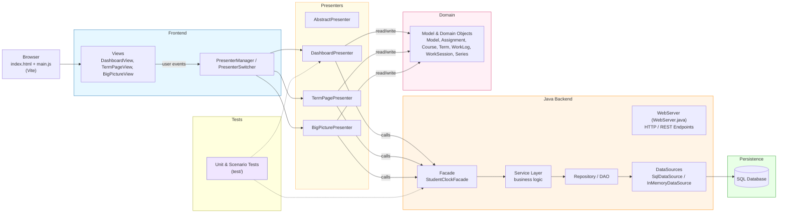

# StudentStudyTracker
A public file of a group project completed for a software engineering class I took at UCSD. 


#when writing this, I referenced documentation at https://mermaid.js.org/intro/syntax-reference.html

## Architecture

### Diagram


## Build, Run, Test

### Run app (JavaFX)

Open the project as a Maven project in your IDE (IntelliJ, VS Code, Eclipse). Find the `edu.ucsd.studentclock.App` class and click Run — the IDE will set up the JavaFX module path for you.

### Run tests

```bash
mvn test
```

## Project Structure

- **`src/main/java/edu/ucsd/studentclock/view`** – JavaFX screens (`DashboardView`, `TermView`, `BigPictureView`) and their small view interfaces (`IDashboardView`, `ITermView`, `IBigPictureView`).
- **`src/main/java/edu/ucsd/studentclock/presenter`** – Presenters plus `AbstractPresenter` (they depend on `StudentClockFacade`, `Clock`, and `I*View` interfaces, not concrete classes).
- **`src/main/java/edu/ucsd/studentclock/model`** – Core domain objects (`Term`, `Course`, `Series`, `Assignment`, `WorkSession`, `WorkLog`) and the `Model` class.
- **`src/main/java/edu/ucsd/studentclock/facade`** – `StudentClockFacade` interface and implementation connecting presenters to the model.
- **`src/main/java/edu/ucsd/studentclock/repository` + `datasource`** – `TermRepository` + `ExampleRepository` and storage backends (`SqlDataSource`, `InMemoryDataSource`).
- **`src/main/java/edu/ucsd/studentclock/util` + `service`** – Time helpers (`Clock`, `AppClock`, `FakeClock`), study‑hours helpers, and big‑picture data builders.
- **`src/test/java`** – Unit + scenario tests, including mock‑based presenter tests under `presenter/`.

## Code Citations / External Help

Very short list of places where we looked at outside help:

- **Mermaid diagram syntax** – when writing the architecture diagram in this README, we referenced the official Mermaid docs: `https://mermaid.js.org/intro/syntax-reference.html`.
- **Presenters** – `DashboardPresenter` and `TermPagePresenter` each have a short Javadoc note saying the initial event‑flow + dialog wiring was drafted with AI help and then edited by us to fit our domain and course requirements.
- **Repository abstraction idea** – `ExampleRepository` mentions the “Lab 4 style: depend on abstraction, not concrete storage”, which we used as inspiration for the `ITermDataSource` + `TermRepository` split.

The DIP refactor (interfaces for views, clocks, repositories) and the mock‑based presenter tests were designed and written by our team on top of this starting point.
